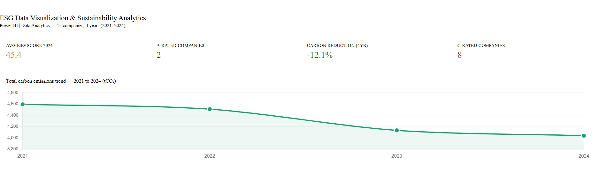
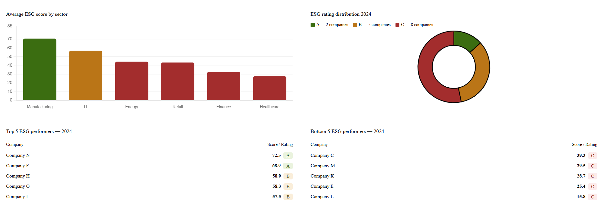

# ESG Sustainability Analytics Dashboard


---

## Overview

This project focuses on ESG (Environmental, Social, and Governance) sustainability analytics using Python-generated datasets and Power BI dashboards.

The dashboard helps organizations monitor:
- Carbon emissions
- Energy consumption
- Water usage
- Sustainability KPIs
- Environmental performance trends

The project simulates a real-world sustainability reporting workflow involving environmental KPI tracking, analytics, and executive dashboard reporting.

---

## Business Problem

Organizations require visibility into sustainability performance and environmental impact metrics to support ESG initiatives, compliance reporting, and strategic decision-making. This project demonstrates how analytics dashboards can improve sustainability monitoring and reporting efficiency.

---

## Tools Used

- Python
- Pandas
- NumPy
- Excel/CSV
- Power BI

---

## Key Features

- ESG KPI Monitoring
- Sustainability Dashboarding
- Carbon Emission Analysis
- Energy Usage Tracking
- Water Consumption Analysis
- Environmental Trend Reporting

---

## Business Impact

- Improved ESG reporting visibility
- Better sustainability KPI tracking
- Faster environmental reporting
- Enhanced data-driven sustainability decisions

---

## Project Structure

```text
esg-sustainability-dashboard/
│
├── data/
│   ├── esg_metrics.csv
│
├── notebooks/
│   ├── generate_esg_data.py
│
├── dashboard/
│   ├── powerbi_instructions.md
│   └── screenshots/
│
├── README.md
├── LICENSE
├── .gitignore
```

---

## Dashboard KPIs

- Carbon Emissions
- Energy Consumption
- Water Usage
- Sustainability Performance Score
- Environmental Trend Metrics

---

## Dashboard Preview

### Sustainability Metrics Dashboard


### Environmental Trend Dashboard


---

## Key Insights

- Carbon emissions show monthly fluctuation trends
- Energy consumption impacts sustainability scores significantly
- Water usage monitoring helps identify operational inefficiencies
- ESG dashboards improve sustainability visibility for leadership

---

## Skills Demonstrated

- ESG Analytics
- Sustainability Reporting
- KPI Dashboarding
- Data Visualization
- Environmental Analytics
- Power BI Dashboarding
- Business Intelligence

---

## Author

Juhi Nakhale  
Data Analyst | Power BI | Fintech Analytics
